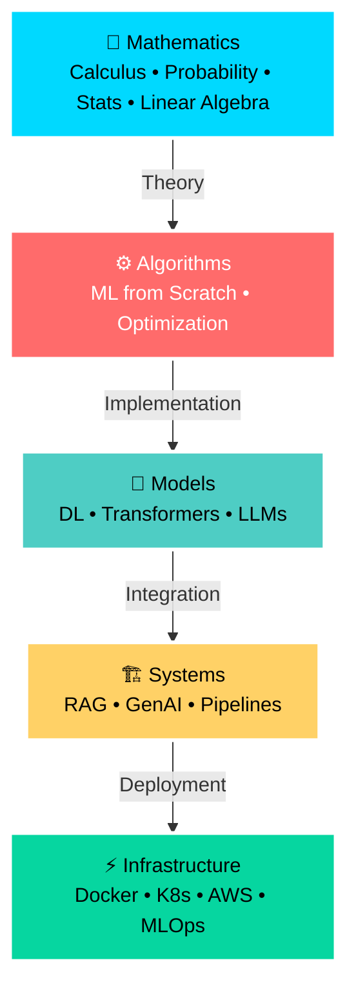
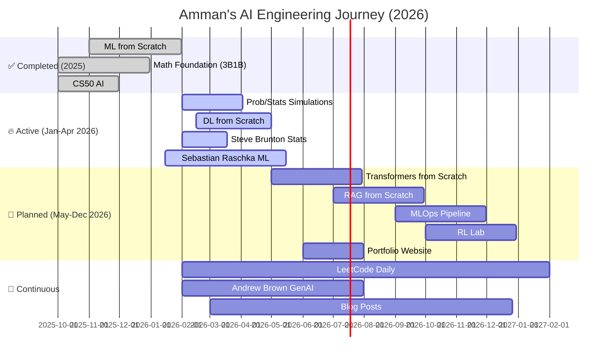

<div align="center">


[](https://git.io/typing-svg)

<p align="center">
  <a href="https://www.linkedin.com/in/ammmanism/">
    
  </a>
  <a href="https://twitter.com/ammmanism">
    
  </a>
  <a href="https://github.com/ammmanism">
    
  </a>
  <a href="mailto:your.email@example.com">
    
  </a>
</p>

<p align="center">
  
  
  
  
</p>

</div>

---

<div align="center">

## 🧭 Core Philosophy

> **Mathematics → Algorithms → Models → Systems → Infrastructure**



<h3>💡 "If I can't derive it, code it, and deploy it — I don't consider it learned."</h3>

**I build AI systems from scratch** — starting from mathematical proofs, implementing core algorithms in NumPy, scaling to PyTorch, and deploying on production infrastructure.

This GitHub is my **public research laboratory** and **engineering notebook**.

</div>

---

## 🎯 What I'm Building Toward

<div align="center">

<table>
<tr>
<td align="center" width="20%">
  
  <br/><strong>Deep Understanding</strong>
  <br/><sub>Math → Code</sub>
</td>
<td align="center" width="20%">
  
  <br/><strong>Mathematical Rigor</strong>
  <br/><sub>Proofs & Derivations</sub>
</td>
<td align="center" width="20%">
  
  <br/><strong>Systems Thinking</strong>
  <br/><sub>Production-Ready</sub>
</td>
<td align="center" width="20%">
  
  <br/><strong>Research Depth</strong>
  <br/><sub>PhD-Level</sub>
</td>
<td align="center" width="20%">
  
  <br/><strong>Production Scale</strong>
  <br/><sub>Docker • K8s • AWS</sub>
</td>
</tr>
</table>

<h3>🌍 Open to Remote Opportunities Globally</h3>

</div>

---

## 📊 Live Skill Matrix (Current as of Feb 2026)

<div align="center">

### 📐 Mathematics Foundation

| Skill | Progress | Topics Covered |
|-------|----------|----------------|
| **Calculus & Optimization** |  | Gradients • Chain Rule • Lagrange Multipliers |
| **Probability Theory** |  | Bayesian Inference • Distributions • Sampling |
| **Statistics** |  | Hypothesis Testing • Estimation • Confidence Intervals |
| **Linear Algebra** |  | Vector Spaces • Eigenvalues • SVD |

### 🤖 Machine Learning

| Skill | Progress | Topics Covered |
|-------|----------|----------------|
| **Supervised Learning** |  | Linear/Logistic Regression • Trees • Ensembles |
| **Unsupervised Learning** |  | K-Means • PCA • Clustering |
| **ML Theory** |  | Bias-Variance • Regularization • PAC Learning |
| **Feature Engineering** |  | Encoding • Scaling • Selection • Creation |

### 🧬 Deep Learning

| Skill | Progress | Topics Covered |
|-------|----------|----------------|
| **Backpropagation** |  | Chain Rule • Computational Graphs • Gradients |
| **Neural Architectures** |  | MLP • CNN • RNN • ResNet |
| **Optimization** |  | SGD • Momentum • Adam • RMSProp |
| **Regularization** |  | Dropout • BatchNorm • L1/L2 |

### 🧠 Transformers & LLMs

| Skill | Progress | Topics Covered |
|-------|----------|----------------|
| **Attention Mechanisms** |  | Self-Attention • Multi-Head • Cross-Attention |
| **Transformer Architecture** |  | Encoder-Decoder • Positional Encoding |
| **LLM Training** |  | Pretraining • Fine-tuning • RLHF |
| **PEFT Methods** |  | LoRA • QLoRA • Adapters |

### 🔍 RAG & GenAI

| Skill | Progress | Topics Covered |
|-------|----------|----------------|
| **Document Processing** |  | Chunking • Parsing • OCR |
| **Retrieval Systems** |  | Dense • Sparse • Hybrid |
| **Vector Databases** |  | Pinecone • Weaviate • FAISS |
| **RAG Evaluation** |  | RAGAS • Faithfulness • Relevancy |

### 🏗️ MLOps & Infrastructure

| Skill | Progress | Topics Covered |
|-------|----------|----------------|
| **Containerization** |  | Docker • Docker Compose |
| **Orchestration** |  | Kubernetes • Helm |
| **CI/CD** |  | GitHub Actions • Testing |
| **Cloud (AWS)** |  | EC2 • S3 • Lambda • SageMaker |

### 🔢 Reinforcement Learning

| Skill | Progress | Topics Covered |
|-------|----------|----------------|
| **Value-Based Methods** |  | Q-Learning • DQN |
| **Policy Gradient** |  | REINFORCE • PPO • A3C |

### 💻 Data Structures & Algorithms

| Skill | Progress | Topics Covered |
|-------|----------|----------------|
| **Core DSA** |  | Arrays • Trees • Graphs • DP |

</div>

---

## 🛠️ Tech Arsenal

<div align="center">

### 💻 Languages & Core Libraries


### 🧠 ML/DL Frameworks


### 🤖 GenAI & LLM Stack


### 🔍 Vector Databases


### ⚙️ Backend & APIs


### ☁️ Cloud & DevOps


### 🗄️ Databases


### 🔧 Tools


</div>

---

## 📚 Learning Journey & Completed Courses

<div align="center">

### ✅ **COMPLETED COURSES** (2025)

<table>
<tr>
<th>Course</th>
<th>Platform/Instructor</th>
<th>Duration</th>
<th>Completion Date</th>
<th>Key Takeaways</th>
</tr>

<tr>
<td>🎥 <b>Essence of Calculus</b></td>
<td>3Blue1Brown (YouTube)</td>
<td>12 videos (~3 hrs)</td>
<td>✅ Nov 2025</td>
<td>Visual intuition for gradients, optimization, chain rule</td>
</tr>

<tr>
<td>🎥 <b>Essence of Probability</b></td>
<td>3Blue1Brown (YouTube)</td>
<td>10 videos (~3 hrs)</td>
<td>✅ Dec 2025</td>
<td>Bayesian thinking, distributions, conditional probability</td>
</tr>

<tr>
<td>🎥 <b>Essence of Linear Algebra</b></td>
<td>3Blue1Brown (YouTube)</td>
<td>16 videos (~4 hrs)</td>
<td>✅ Dec 2025</td>
<td>Geometric intuition, transformations, eigenvectors</td>
</tr>

<tr>
<td>📚 <b>CS50's Introduction to AI</b></td>
<td>Harvard (edX)</td>
<td>7 weeks</td>
<td>✅ Oct 2025</td>
<td>Search, optimization, ML basics, neural networks</td>
</tr>

<tr>
<td>🎥 <b>Machine Learning Fundamentals</b></td>
<td>StatQuest (YouTube)</td>
<td>50+ videos</td>
<td>✅ Nov 2025</td>
<td>ML algorithms explained with clarity and humor</td>
</tr>

</table>

### 📖 **IN PROGRESS** (Jan - Apr 2026)

<table>
<tr>
<th>Course</th>
<th>Platform/Instructor</th>
<th>Duration</th>
<th>Progress</th>
<th>Focus</th>
<th>Target Completion</th>
</tr>

<tr>
<td>🎥 <b>Data-Driven Science & Engineering</b></td>
<td>Steve Brunton (YouTube)</td>
<td>35 videos (~8 hrs)</td>
<td></td>
<td>Applied statistics, hypothesis testing</td>
<td>Mar 2026</td>
</tr>

<tr>
<td>🎥 <b>Machine Learning Course</b></td>
<td>Sebastian Raschka (YouTube)</td>
<td>95 videos (~40 hrs)</td>
<td></td>
<td>Deep ML theory + hands-on practice</td>
<td>Apr 2026</td>
</tr>

<tr>
<td>🎥 <b>GenAI Intensive Bootcamp</b></td>
<td>Andrew Brown</td>
<td>66+ hours</td>
<td></td>
<td>Production GenAI systems, RAG pipelines</td>
<td>Apr 2026</td>
</tr>

<tr>
<td>📚 <b>Deep Learning Book</b></td>
<td>Goodfellow, Bengio, Courville</td>
<td>Self-paced</td>
<td></td>
<td>Comprehensive DL theory</td>
<td>Apr 2026</td>
</tr>

<tr>
<td>📚 <b>Pattern Recognition & ML</b></td>
<td>Christopher Bishop</td>
<td>Self-paced</td>
<td></td>
<td>Mathematical ML foundations</td>
<td>Apr 2026</td>
</tr>

<tr>
<td>🎥 <b>Fast.ai Practical Deep Learning</b></td>
<td>Jeremy Howard</td>
<td>~40 hours</td>
<td></td>
<td>Practical DL for coders</td>
<td>Apr 2026</td>
</tr>

<tr>
<td>🎥 <b>NLP Specialization</b></td>
<td>Hugging Face</td>
<td>Self-paced</td>
<td></td>
<td>Transformers, tokenization, fine-tuning</td>
<td>Apr 2026</td>
</tr>

<tr>
<td>📚 <b>Reinforcement Learning</b></td>
<td>Sutton & Barto</td>
<td>Self-paced</td>
<td></td>
<td>RL theory and algorithms</td>
<td>Apr 2026</td>
</tr>

</table>

### 📅 **PLANNED FOR 2026**

- 🎓 **Stanford CS229** - Machine Learning (Andrew Ng)
- 🎓 **MIT 6.S191** - Introduction to Deep Learning
- 🎓 **Berkeley CS285** - Deep Reinforcement Learning
- 🎓 **Stanford CS224N** - NLP with Deep Learning
- 🎓 **AWS Machine Learning Specialty** - Certification
- 📚 **Designing Data-Intensive Applications** - Martin Kleppmann
- 📚 **Hands-On Machine Learning** - Aurélien Géron (3rd Edition)

</div>

---

## 🚀 Repository Ecosystem

<div align="center">

### ✅ **COMPLETED PROJECTS**

<table>
<tr>
<td width="100%">

### 🎯 [ml-from-scratch](https://github.com/ammmanism/ml-from-scratch) ✅


**Foundation Complete: ML Algorithms from Mathematical First Principles**

```python
# Linear Regression
∂L/∂w = (1/n)X^T(Xw - y)
w := w - α·∂L/∂w

# Logistic Regression  
σ(z) = 1/(1 + e^(-z))
∂L/∂w = (1/n)X^T(σ(Xw) - y)
```

**Fully Implemented:**
- ✅ Linear Regression (OLS, Gradient Descent, Ridge, Lasso)
- ✅ Logistic Regression (Binary, Multiclass, Regularized)
- ✅ K-Nearest Neighbors (Classification, Regression, Distance Metrics)
- ✅ K-Means Clustering (with elbow method, silhouette analysis)
- ✅ Naive Bayes (Gaussian, Multinomial, Bernoulli)
- ✅ Decision Trees (CART algorithm, pruning)
- ✅ Random Forests (Bagging, feature importance)
- ✅ Support Vector Machines (Linear, Kernel methods)
- ✅ Principal Component Analysis (PCA)
- ✅ Gradient Boosting basics

**Key Features:**
- 📐 Math-first approach (derivations → code)
- 🧪 100% unit tested against sklearn
- 📊 Visual comparisons & insights
- 📝 Comprehensive documentation with theory
- 🎯 Performance benchmarking

**Completed:** January 2026

[📖 View Repository →](https://github.com/ammmanism/ml-from-scratch)

</td>
</tr>
</table>

### 🚧 **ACTIVE DEVELOPMENT**

<table>
<tr>
<td width="50%">

### 📊 [probability-statistics-simulations](https://github.com/ammmanism/probability-statistics-simulations)


**Statistical Intuition Through Code**

**Implemented:**
- ✅ Monte Carlo simulations
- ✅ Common distributions (Normal, Binomial, Poisson)
- 🚧 Bayesian inference from scratch

**In Progress:**
- 🚧 Hypothesis testing (t-test, ANOVA, chi-square)
- 🚧 Resampling methods (Bootstrap, Permutation)

**Planned:**
- 📅 Central Limit Theorem demonstrations
- 📅 Markov Chain Monte Carlo (MCMC)

**Expected Completion:** March 2026

</td>
<td width="50%">

### 🧬 [deep-learning-from-scratch](https://github.com/ammmanism/deep-learning-from-scratch)


**Neural Networks: Theory → Code**

**Implemented:**
- ✅ Backpropagation mathematics
- ✅ Dense layers
- ✅ Activation functions (ReLU, Sigmoid, Tanh, Softmax)
- 🚧 Convolutional layers

**In Progress:**
- 🚧 BatchNorm implementation
- 🚧 Dropout regularization
- 🚧 Advanced optimizers (Adam, RMSProp)

**Expected Completion:** April 2026

</td>
</tr>
</table>

### 📅 **PLANNED FOR 2026**

<table>
<tr>
<td width="33%">

### 🧠 [transformers-from-scratch](https://github.com/ammmanism/transformers-from-scratch)


**Attention → GPT/BERT**

**Roadmap:**
- Scaled dot-product attention
- Multi-head attention
- Positional encoding
- Encoder/Decoder blocks
- GPT-style generation
- BERT-style pretraining

```python
Attention(Q,K,V) = 
  softmax(QK^T/√d_k)V
```

**Timeline:** May - July 2026

</td>
<td width="33%">

### 🔍 [rag-from-scratch](https://github.com/ammmanism/rag-from-scratch)


**Production RAG Pipeline**

**Components:**
- Document processing
- Chunking strategies
- Embedding models
- Vector search (FAISS, Pinecone)
- Retrieval methods
- Generation + RAGAS evaluation

**Timeline:** July - September 2026

</td>
<td width="33%">

### ⚙️ [mlops-pipeline](https://github.com/ammmanism/mlops-pipeline)


**End-to-End ML System**

**Pipeline:**
1. Data ingestion
2. Feature engineering
3. Model training
4. Deployment (FastAPI)
5. Monitoring
6. CI/CD

**Timeline:** September - November 2026

</td>
</tr>

<tr>
<td width="33%">

### 🎮 [reinforcement-learning-lab](https://github.com/ammmanism/rl-lab)


**RL Algorithms from Scratch**

**Algorithms:**
- Q-Learning
- Deep Q-Networks (DQN)
- Policy Gradient
- PPO
- Actor-Critic

**Timeline:** October - December 2026

</td>
<td width="33%">

### 💻 [leetcode-solutions](https://github.com/ammmanism/leetcode-solutions)


**DSA for AI Engineers**

**Progress:**
- Arrays & Strings: 45/100
- Trees & Graphs: 30/80
- Dynamic Programming: 15/60
- Total: 120/300

**Goal:** 300+ problems by Dec 2026

</td>
<td width="33%">

### 🌐 [portfolio-website](https://github.com/ammmanism/portfolio)


**Professional Portfolio**

**Features:**
- Project showcase
- Blog integration
- Interactive demos
- Resume & contact

**Stack:** Next.js, Tailwind, MDX

</td>
</tr>
</table>

</div>

---

## 🏗️ Project Architecture Philosophy

<div align="center">

```
┌─────────────────────────────────────────────────────────┐
│                  REPO STRUCTURE TEMPLATE                 │
├─────────────────────────────────────────────────────────┤
│  repo-name/                                             │
│  ├── 📄 README.md          ← Problem • Math • Solution │
│  ├── 📦 pyproject.toml     ← Dependencies               │
│  ├── 🔧 Makefile           ← Commands                   │
│  ├── 🐳 Dockerfile         ← Containerization           │
│  │                                                       │
│  ├── 📁 src/               ← Production code            │
│  │   ├── __init__.py                                    │
│  │   ├── models/          ← Algorithms                  │
│  │   ├── utils/           ← Helpers                     │
│  │   └── viz/             ← Visualizations              │
│  │                                                       │
│  ├── 📓 notebooks/         ← Experiments & intuition    │
│  │   ├── 01_theory.ipynb                                │
│  │   ├── 02_implementation.ipynb                        │
│  │   └── 03_comparison.ipynb                            │
│  │                                                       │
│  ├── 🧪 tests/             ← Unit tests                 │
│  │   ├── test_models.py                                 │
│  │   └── test_utils.py                                  │
│  │                                                       │
│  ├── 📚 docs/              ← Theory & math              │
│  │   ├── theory.md        ← Mathematical foundations    │
│  │   ├── derivations.md   ← Step-by-step proofs         │
│  │   └── api.md           ← Code documentation          │
│  │                                                       │
│  ├── 🚀 examples/          ← Real-world usage           │
│  │   ├── basic_example.py                               │
│  │   └── advanced_demo.py                               │
│  │                                                       │
│  └── 📊 data/              ← Sample datasets            │
│      ├── raw/                                            │
│      └── processed/                                      │
└─────────────────────────────────────────────────────────┘
```

**Every README Answers:**
1. ❓ **What problem?** — Real-world motivation
2. 📐 **What math?** — Mathematical foundation
3. ⚙️ **What algorithm?** — Step-by-step explanation
4. 💡 **Why it works?** — Intuition & proofs
5. 🚀 **How it scales?** — Complexity & optimization

</div>

---

## 📊 GitHub Analytics Dashboard

<div align="center">

<table>
<tr>
<td align="center" width="50%">
  
### 📈 Overall Stats


</td>
<td align="center" width="50%">

### 🔥 Streak Stats


</td>
</tr>
</table>

### 📊 Activity Graph


### 💻 Language Distribution


### 🏆 Trophies


</div>

---

## 📅 2026 Roadmap & Timeline

<div align="center">



</div>

---

## 🎯 Current Focus & Milestones (February 2026)

<div align="center">

| Project | Status | Current Sprint | Next Milestone | Completion Target |
|---------|--------|---------------|----------------|-------------------|
| **ml-from-scratch** | ✅ COMPLETED | — | Archive & document | Completed Jan 2026 |
| **prob-stats-simulations** | 🔥 ACTIVE | Bayesian inference | Complete hypothesis testing | March 2026 |
| **deep-learning-scratch** | 🔥 ACTIVE | Conv2D layers | Complete CNN implementation | April 2026 |
| **Steve Brunton Stats** | 📚 LEARNING | Video 21/35 | Finish all videos | March 2026 |
| **Sebastian Raschka ML** | 📚 LEARNING | Video 42/95 | Complete course | April 2026 |
| **LeetCode Practice** | ⚡ DAILY | 120/300 problems | Reach 200 problems | June 2026 |
| **transformers-scratch** | 📅 PLANNED | Planning phase | Start implementation | May 2026 |

</div>

---

## 🏆 2026 Goals & Achievements

<div align="center">

### ✅ Achievements Unlocked (2025)

- ✅ **ML from Scratch** — Complete implementation (Jan 2026)
- ✅ **3Blue1Brown Math Series** — All courses completed (Dec 2025)
- ✅ **CS50 AI** — Certificate earned (Oct 2025)
- ✅ **100+ LeetCode Problems** — Milestone reached (Jan 2026)

### 🎯 2026 Target Milestones (Max Completion: April 2026)

| Milestone | Target Date | Progress |
|-----------|-------------|----------|
| 📐 Complete Math & Stats Foundation | Q1 2026 |  |
| 🧬 Deep Learning from Scratch | Q2 2026 |  |
| 🧠 Transformers Implementation | Q3 2026 |  |
| 🔍 Production RAG System | Q3 2026 |  |
| ⚙️ MLOps Pipeline | Q4 2026 |  |
| 🏅 First Kaggle Medal | Q2 2026 |  |
| 💻 LeetCode 300+ Problems | Q4 2026 |  |
| 💼 Portfolio Website Live | Q2 2026 |  |
| 📝 Publish 10 Technical Blogs | Q4 2026 |  |

</div>

---

## 📝 Blog & Technical Writing (Planned)

<div align="center">

> **"The best way to learn is to teach. Writing forces clarity."**

### 🎯 Planned Blog Series

| Title | Focus | Target Date | Status |
|-------|-------|-------------|--------|
| **Why Build ML from Scratch?** | Philosophy & Learning | March 2026 | ✍️ Drafting |
| **Mathematical Intuition: Backpropagation** | Deep Learning | April 2026 | 📚 Researching |
| **Implementing Attention from NumPy** | Transformers | June 2026 | 🎯 Planned |
| **Building Production RAG Systems** | GenAI | August 2026 | 🔮 Future |
| **MLOps for Solo Developers** | Infrastructure | October 2026 | 🔮 Future |
| **RL Fundamentals with Code** | Reinforcement Learning | November 2026 | 🔮 Future |

</div>

---

## 🤝 Collaboration & Open Source

<div align="center">

### 💼 **Open to Remote Opportunities**

I am actively seeking **remote AI/ML engineering roles** with:
- 🌍 **Location:** Remote-first (Global)
- 💼 **Role Type:** Full-time, Contract, Freelance
- 🎯 **Focus Areas:** ML/DL, NLP, LLMs, RAG Systems, MLOps
- 📍 **Current Location:** Gorakhpur, India
- 🕐 **Availability:** Immediate (February 2026)

### I'm Open To:

<table>
<tr>
<td align="center" width="25%">
  
  <br/><b>Research Projects</b>
  <br/><sub>ML/DL collaborations</sub>
</td>
<td align="center" width="25%">
  
  <br/><b>Open Source</b>
  <br/><sub>Contributing to AI libraries</sub>
</td>
<td align="center" width="25%">
  
  <br/><b>Technical Writing</b>
  <br/><sub>Educational content</sub>
</td>
<td align="center" width="25%">
  
  <br/><b>Real Projects</b>
  <br/><sub>Production AI systems</sub>
</td>
</tr>
</table>

### Looking For:

- 🎓 **Mentorship** from experienced ML researchers/engineers
- 👥 **Study groups** for advanced ML topics
- 🔬 **Research collaborations** on interesting problems
- 💼 **Remote AI/ML engineering roles** (Full-time or Contract)
- 📚 **Paper reading groups** & discussion forums
- 🤝 **Open source contributions** to major AI/ML projects

</div>

---

## 📬 Connect With Me

<div align="center">

<table>
<tr>
<td align="center" width="25%">
  <a href="https://www.linkedin.com/in/ammmanism/">
    
    <br/><b>LinkedIn</b>
    <br/><sub>Professional Network</sub>
  </a>
</td>
<td align="center" width="25%">
  <a href="https://twitter.com/ammmanism">
    
    <br/><b>Twitter</b>
    <br/><sub>Learning in Public</sub>
  </a>
</td>
<td align="center" width="25%">
  <a href="https://github.com/ammmanism">
    
    <br/><b>GitHub</b>
    <br/><sub>Code & Projects</sub>
  </a>
</td>
<td align="center" width="25%">
  <a href="mailto:your.email@example.com">
    
    <br/><b>Email</b>
    <br/><sub>Direct Contact</sub>
  </a>
</td>
</tr>
</table>

<br/>

[](https://www.linkedin.com/in/ammmanism/)
[](https://twitter.com/ammmanism)
[](https://github.com/ammmanism)
[](mailto:your.email@example.com)


</div>

---

<div align="center">

## 💭 My Philosophy

```
╔════════════════════════════════════════════════════════════════╗
║                                                                ║
║  "I don't just train models — I understand why they work.     ║
║   I don't just use tools — I build them from scratch.         ║
║   I don't just follow tutorials — I derive the theory.        ║
║   I don't just deploy code — I understand the infrastructure. ║
║                                                                ║
║   Building slowly, deeply, and correctly.                     ║
║   Because foundations matter."                                ║
║                                                                ║
╚════════════════════════════════════════════════════════════════╝
```

---

### 🌟 If you find my work interesting, consider:

⭐ **Starring** my repositories  
👀 **Following** my journey  
🤝 **Collaborating** on projects  
💬 **Sharing** feedback & suggestions  
💼 **Reaching out** for opportunities

---

<sub>Last Updated: February 3, 2026 | Built with passion for AI research & engineering | Open to Remote Work 🌍</sub>


</div>
